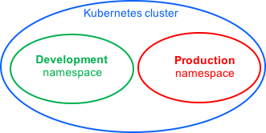

# Create new namespaces

For this exercise, we will create two additional Kubernetes namespaces to hold our content.

Let's imagine a scenario where an organization is using a shared Kubernetes cluster for development and production use cases.

The **development team** would like to maintain a space in the cluster where they can **get a view on the list of Pods, Services, and Deployments** they use to **build and run** their application. In this space, Kubernetes resources come and go, and the **restrictions** on who can or cannot modify resources **are relaxed** to enable agile development.

The **operations team** would like to maintain a space in the cluster where they can **enforce strict procedures** on who can or cannot **manipulate** the set of **Pods, Services, and Deployments** that run the **production site**.

One pattern this organization could follow is to partition the Kubernetes cluster into two namespaces: **development* and *production**.



Let's create two new namespaces to hold our work.

1. Use the file `namespace-dev.json` which describes a `development` namespace:

    `cat namespace-dev.json`{{execute}}

    Output:
    
    ```
    {
        "apiVersion": "v1",
        "kind": "Namespace",
        "metadata": {
            "name": "development",
            "labels": {
                "name": "development"
            }
        }
    }
    ```

2. Create the `development` namespace using `kubectl`:

    `kubectl create -f namespace-dev.json`{{execute}}

    Output:

    `TODO`

3. Next, let's create the `production` namespace:

    `cat namespace-prod.json`{{execute}}

    Output:
    
    ```
    {
        "apiVersion": "v1",
        "kind": "Namespace",
        "metadata": {
            "name": "production",
            "labels": {
                "name": "production"
            }
        }
    }
    ```

    `kubectl create -f namespace-prod.json`{{execute}}


4. To be sure things are right, let's list all of the namespaces in our cluster:

    `kubectl get namespaces --show-labels`{{execute}}

    Output:
    
    ```
    NAME          STATUS    AGE       LABELS
    default       Active    32m       <none>
    development   Active    29s       name=development
    production    Active    23s       name=production
    ```
